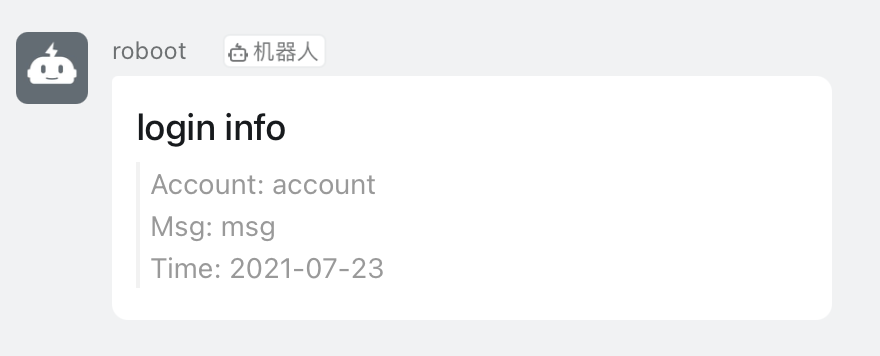
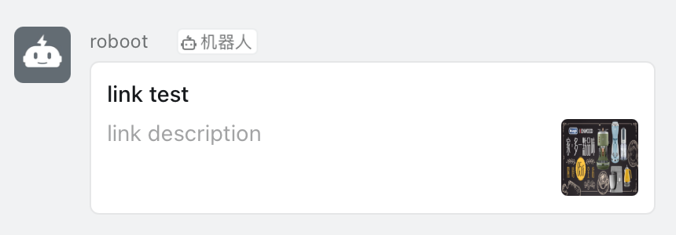
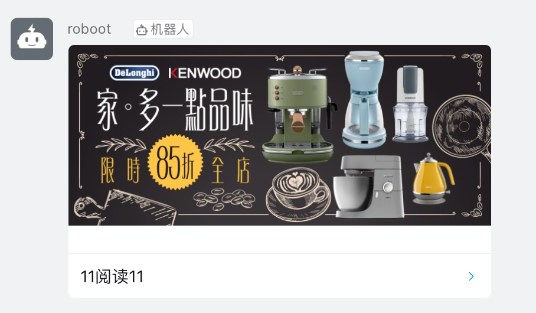
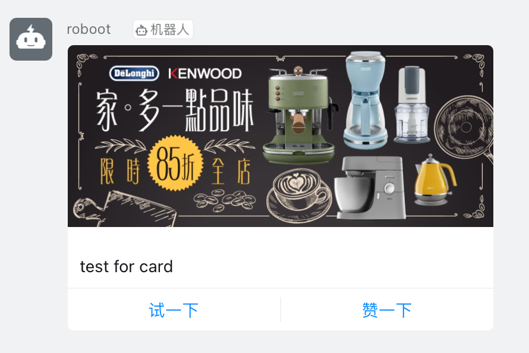
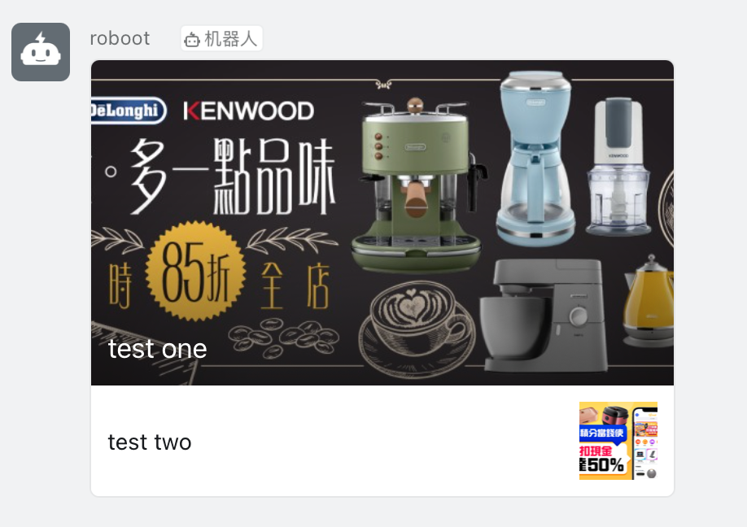

# 钉钉群机器人Golang SDK

本包为钉钉群机器人服务端golang语言sdk封装实现，实现了钉钉群机器人消息发送相关接口。

> 支持的消息类型和消息发送出去后的样式有如下6种

## 1、文本 Text

## 2、Markdown

## 3、链接 Link

## 4、单按钮卡片 ActionCard

## 5、多按钮卡片 ActionCardWithMultiBtn

## 6、信息流 FeedCard

调用代码参考：[https://github.com/jjonline/share-mod-lib/tree/development/example/ding](https://github.com/jjonline/share-mod-lib/tree/master/example/ding)
